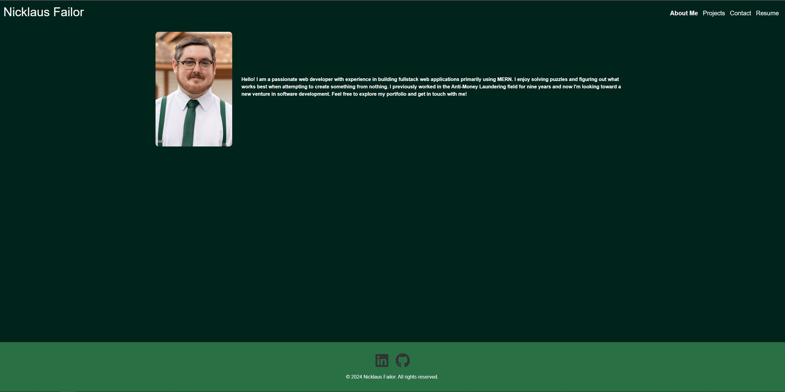

# React-Portfolio README.md
  |[GitHub License](https://img.shield.io/badge/ISC=blue)

  ## Description

  This app is a functional portfolio to describe myself, show some projects I have created/contributed, how to contact me, and a downloadable link to my resume"

  ## Table of Contents

  - [Installation](#installation)

  - [Usage](#usage)

  - [Licensing](#license)

  - [Contribution](#contribution)

  - [Tests](#testing)

  - [Questions](#questions)

  ## Installation

  To install necessary dependencies, run the following command:

  npm i

  ## Usage

  This project is used in order to get to know me better as a developer and view some apps I have created. You can view a screenshot of the home page below:

  

  ## Licensing

  This project is licensed under the ISC license. [
  This license link for this project is https://opensource.org/license/ISC/

  ## Contributing

  No contribution necessary at this time

  ## Tests

  To run tests, run the following command:

  N/A

  ## Questions

  If you have any questions about this repository, feel free to open an issue or contact me directly at nfailor@gmail.com.
  You can find more of my work at https://github.com/nfailor

